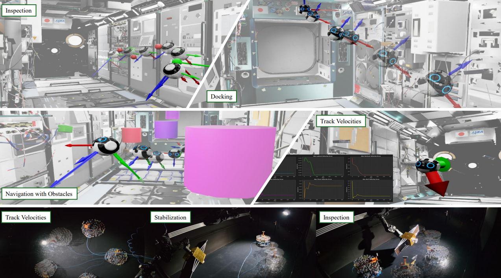

---

# Learning Adaptive Multi-Task Guidance, Navigation, and Control via Hypernetworks

[](https://docs.isaacsim.omniverse.nvidia.com/latest/index.html)
[](https://docs.python.org/3/whatsnew/3.10.html)
[](https://releases.ubuntu.com/20.04/)
[](https://www.microsoft.com/en-us/)
[](https://github.com/isaac-sim/IsaacLab/actions/workflows/pre-commit.yaml)
[](https://github.com/isaac-sim/IsaacLab/actions/workflows/docs.yaml)
[](https://opensource.org/licenses/BSD-3-Clause)
[](https://opensource.org/license/apache-2-0)


We introduce a novel hypernetwork-based framework for Multi-Task Reinforcement Learning (MTRL) that addresses these limitations by learning a single, generalizable policy for multiple diverse robotic systems:
- **High Speed Racing**: Our framework enables a single policy to successfully race on a variety of unseen tracks.
- **Floating Platform**: a single hypernetwork policy effectively performs four distinct control objectives: stabilization, docking, velocity tracking, and rendezvous.
- **Sim-to-real**: validation for the floating platform tasks.
- **Code and Weights**: Opens-source of the entire stack.


## Getting Started

### Clone the repo and go to the corresponding branch:
```
git clone 
cd Isaaclab_RANS
```

### Build and start the docker
```
./docker/container.py build
./docker/container.py start
```

### Train

```
./scripts/reinforcement_learning/rsl_rl/control_train_hypernet.sh
```

### Eval
You can download the weights form the google drive and add them inside the `logs` folder of the docker. [Download link](https://drive.google.com/drive/folders/1S7xDNgK4fZporHZsNk_Xj_RW-0p9lY61?usp=sharing).

```
./scripts/reinforcement_learning/rsl_rl/control_eval_hypernet.sh
```
